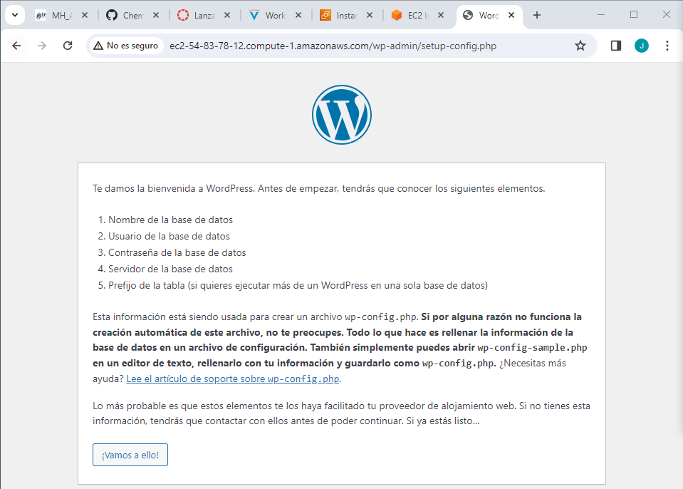

# Actividad 1.3.1 WordPress

En esta práctica tendremos que realizar la instalación de WordPress en una instancia EC2 de Amazon Web Services. Para ello comenzamos actualizando los repositorios con el siguiente comando.
``` 
sudo apt update
```
Una vez hecho esto instalaremos otros paquetes php necesarios.


Una vez instalados todos los paquetes tenemos que crear y configurar la base de datos. Para ello nos logeamos en mysql con el usuario root y tenemos que escribir los siguientes comandos.


A continuación tenemos que configurar apache 2, para configurarlo debemos editar el archivo **000-default.conf** de forma de que el archivo nos quede de la siguiente manera.


Ahora tenemos que activar el mod rewrite para utilizar la función de permalink o enlace permanente de WordPress. Esta acción se completa con el siguiente comando y reiniciamos el sevidor web de Apache con el segundo comando.
``` 
a2enmod rewrite
systemctl restart apache2
```
Una vez completados todos los preparativos, es el momento de instalar WordPress. Se puede realizar mediante dos métodos: configurar WordPress a través de una interfaz web o editar manualmente el archivo wp-config.php. Nosotros lo vamos a hacer a través de la interfaz web.  
Comenzamos instalando el paquete wget en la máquina virtual. 


A continuación, utilizamos el comando wget seguido del enlace de descarga de WordPress.


Una vez descargado el archivo, instalamos la utilidad de descompresión unzip con el siguiente comando. Y descomprimimos el archivo **latest-es_ES.zip**.
``` 
sudo apt install unzip -y
```
El contenido se ha descomprimido en la carpeta wordpress, por lo que tenemos que mover el contenido de */tpm/wordpress* a */var/www/html*.  
Por último cambaimos el usuario propietario del documentRoot y reiniciamos el servicio de apache2 como hicimos anteriormente.


Terminamos de configurar el WordPress a través del navegador web poniendo el nombre de la ip pública de nuestro servidor añadiendo al final */index.php*.



A continuación, iniciamos sesión para acceder al panel de administración de WordPress.


Una vez rellenado los datos nos pedirá iniciar sesión con el usuario y la contraseña.
Cuando pongamos la contraseña y el usuario se nos abrirá el panel de control de WordPress.

